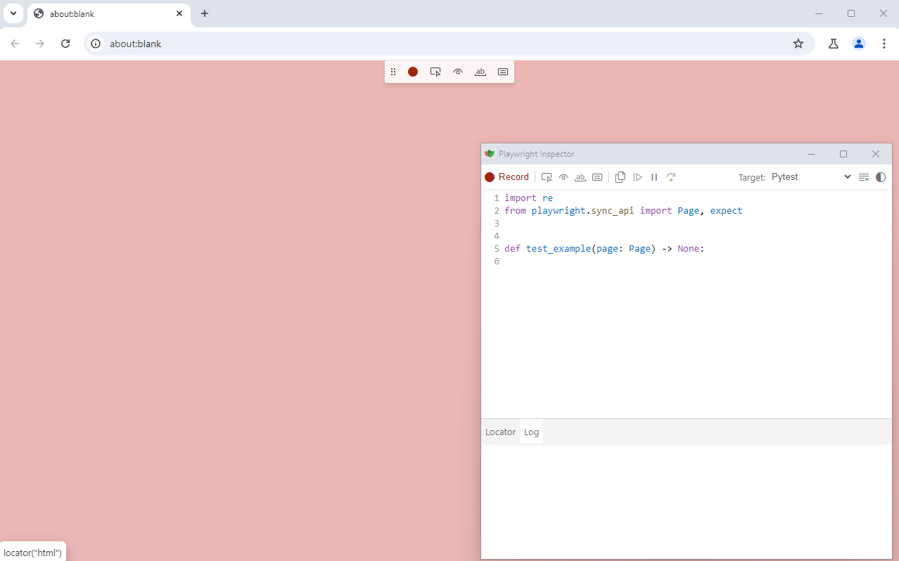
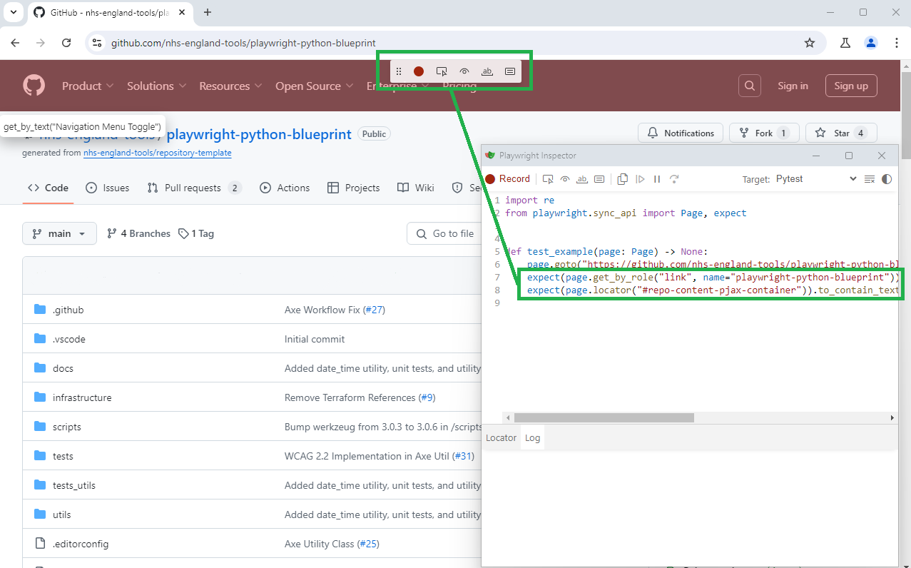
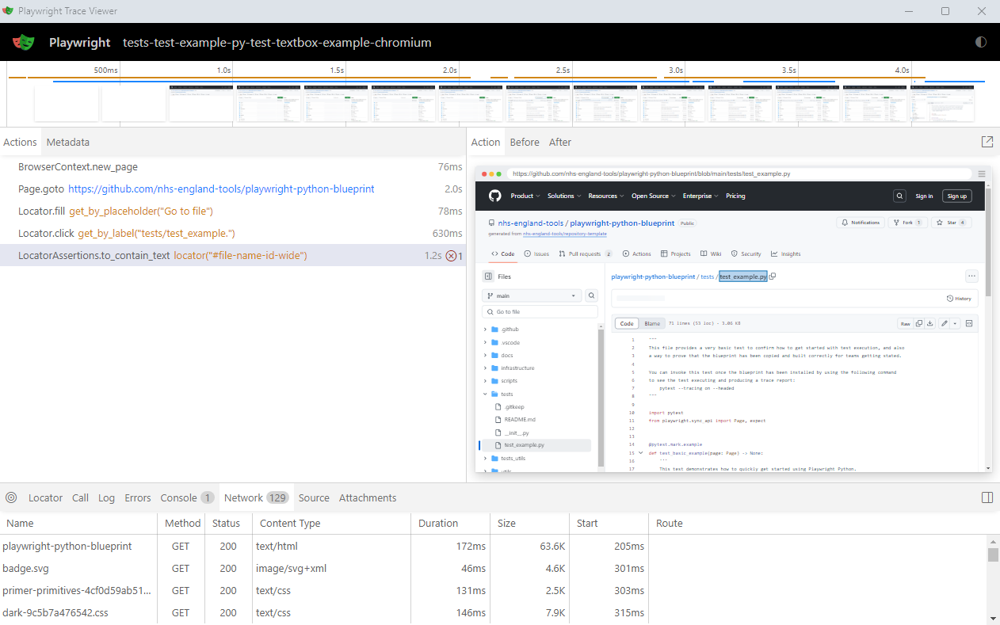

# Getting Started #1: Understanding Playwright Python

This guide outlines how Playwright works in Python, and how to start writing tests in the format this blueprint recommends.

## Contents

- [Getting Started #1: Understanding Playwright Python](#getting-started-1-understanding-playwright-python)
  - [Contents](#contents)
  - [The Basics](#the-basics)
  - [How Does pytest Work](#how-does-pytest-work)
  - [Executing Tests](#executing-tests)
  - [Using pytest Logic](#using-pytest-logic)
  - [Utilising Playwright `codegen`](#utilising-playwright-codegen)
  - [Utilising Playwright `show-trace`](#utilising-playwright-show-trace)
  - [Further Reading](#further-reading)
  - [Appendix](#appendix)
    - [Info: What Is Chromium](#info-what-is-chromium)

## The Basics

For Python, Playwright is treated as a plugin for a unit testing framework called [pytest](https://docs.pytest.org/en/stable/) and
expands the functionality provided by pytest to allow for interaction with browsers (and allow us to write UI tests using the same logic)
along with other testing utilities. Because of this, in this blueprint you will see references to pytest regularly, as it is the engine
that drives the test execution.

## How Does pytest Work

In the case of this blueprint, pytest works by
[scanning directories within the code base to discover tests](https://docs.pytest.org/en/stable/explanation/goodpractices.html#test-discovery),
where by default it looks for any files in the format of `test_*.py` or `*_test.py`. Once the files have been discovered, it'll check for any
functions in the file starting with `test_` and if found, will execute that function as a test and collect the result.

pytest will spin up any utilities it needs to execute tests (including any we choose to define), which for this framework includes a number of
Playwright-specific objects we would likely want to utilise, including:

- `page`: The Playwright page object, which we use to interact with a browser page during tests. You'll likely use this object for every test.
- `browser`: The Playwright browser object, which we use to create and manage the browser directly and create new pages if required. It's unlikely you'll need to include this unless you have a very specific browser test.
- `playwright`: The Playwright object, which we can use to manage the Playwright instance during testing. It's extremely unlikely you'll need this when pytest is the test executor.

For further reading on pytest, it's recommended to read the [full documentation](https://docs.pytest.org/en/stable/).

## Executing Tests

Because pytest is the engine in this blueprint, we use the pytest command to initiate any test execution. This can be done as simply by using
the following command in the command line against this blueprint (once the initial setup has been completed):

    pytest

When using this command, it will run any tests with the default configuration provided by pytest and Playwright (which in the case of UI testing,
normally means that it'll run all tests against the [Chromium](#info-what-is-chromium) browser that was installed).

If you want to execute tests with specific settings, such as a specific browser or to specify specific tests to run, these can be passed in on the
command line after the pytest command or via the [pytest.ini](../../pytest.ini) file (using the `addopts` section).

For further reading on the kinds of settings you can apply with pytest, take a look at our [Quick Reference Guide](./Quick_Reference_Guide.md).

## Using pytest Logic

When we use Playwright with pytest, a number of objects that we may want to interact with are automatically generated, but the most pertinent
of these is the `page` object, which represents the browser page object we want to interact with. Because it's provided automatically when we
start a test run, we do not need to do any specific configuration with the test other than add a reference to this page object in the function
arguments for the test like so:

    # Doing an import like this for the page object isn't required, but is considered good practice
    from playwright.sync_api import Page

    # An example call showing how the page object is brought into a test, and how it can be used
    def test_example(page: Page) -> None:
        page.goto("https://github.com/nhs-england-tools/playwright-python-blueprint")

As you can see from the example, the only setup for the `page` object here is in the function arguments, and we can use it as needed in the test.
We can also use this logic to create utilities and resources that can be utilised by our tests, and easily pass them in to be used as needed.

The `page` object is an example of a fixture, which are actions that can be run before or after any tests we want to execute (these are known as
hooks in other test automation frameworks). A fixture is normally defined at the start of a set of tests, in a format like so:

    # Doing an import like this for the page object isn't required, but is considered good practice
    from playwright.sync_api import Page

    # An example fixture, which runs before the start of every test in this module
    @pytest.fixture(autouse=True)
    def go_to_page(page: Page) -> None:
        page.goto("https://github.com/nhs-england-tools/playwright-python-blueprint")

    # An example test which continues on from the fixture above
    def test_example(page: Page) -> None:
        page.get_by_placeholder("Go to file").fill("test_example.py")
        page.get_by_label("tests/test_example.").click()
        expect(page.locator("#file-name-id-wide")).to_contain_text("test_example.py")

This allows for easy reuse of steps and reducing overall test maintenance going forward. Fixtures can play a powerful part in how you design
your tests, including creating utilities available for global use, or just adding repeatable actions in a way that can overall reduce the
maintenance effort of your tests going forward.

Further reading on fixtures can be found in the [Playwright documentation](https://playwright.dev/python/docs/test-runners#fixtures).

## Utilising Playwright `codegen`

If you're new to Playwright, Python or automating tests generally, then
[Playwright provides a code generation tool](https://playwright.dev/python/docs/codegen#recording-a-test) that allows you to manually navigate
through a browser to generate the code for a test. You can access the `codegen` tool by using the following command:

    # Load a empty browser window
    playwright codegen

This will bring up a browser window, with the Playwright code generator running alongside, like so:

<!-- vale off -->

<!-- vale on -->

When using the `codegen` tool, it is recommended to do the following:

- Pass in a starting URL where possible to set the window at your starting location (e.g. `playwright codegen https://github.com/nhs-england-tools/playwright-python-blueprint`)
- When using the Playwright Inspector window, set the target value to Pytest as it'll automatically format any generated tests into the pytest format we recommend using in this blueprint

The `codegen` tool is particularly powerful, as it also allows you to consider assertions on the page you are hoping to test. Currently, you can do the following
basic assertions using the `codegen` tool:

- Assert visibility of an element on the page
- Assert specific text is present within an element on the page
- Assert an element on the page has a specific value

These are accessible via the floating menu when using the `codegen` tool, as highlighted in green here:

<!-- vale off -->

<!-- vale on -->

Whilst the `codegen` tool will provide you with the basic code to get started, it's recommended that once you've got a working test, you consider refactoring any
code that has been provided and refine as needed. Having the ability to generate the code in this fashion allows you to create tests quickly and build up
understanding of how to construct tests using Playwright Python, but you will soon discover that they may not be the most efficient in their raw state!

## Utilising Playwright `show-trace`

If you encounter issues when trying to execute your newly created tests,
[Playwright also provides a trace functionality](https://playwright.dev/python/docs/trace-viewer-intro) that records each action a test
undertakes and outlines where any issues or errors have occurred. This can be useful for a number of reasons, including:

- Easily pinpointing problems within a test, including functional and performance concerns
- Generating evidence to show stakeholders what a test actually does during execution
- The ZIP file generated can be opened on any machine, or via a [browser utility provided by Playwright](https://trace.playwright.dev/)

To open a trace file, use the following command (replacing `<path-to-file>` with the actual path to the trace.zip file generated):

    # Opens a trace file
    playwright show-trace <path-to-file>

A trace file when opened looks like this:

<!-- vale off -->

<!-- vale on -->

The primary information provided within the trace is:

- A timeline of events with screenshots (at the top of the report)
- A summary of each action undertaken (on the left side of the report)
- A screenshot of the selected action (on the right side of the report)
- The network and test activity (at the bottom of the report)

As you can see, it provides a lot of information to work with to help demonstrate what a test is doing, and diagnosing
any issues when something goes wrong.

## Further Reading

Here are some useful links for further reading beyond these guides:

- [Playwright Python documentation](https://playwright.dev/python/docs/intro)
- [pytest documentation](https://docs.pytest.org/en/stable/index.html)

## Appendix

### Info: What Is Chromium

[Chromium](https://www.chromium.org/Home/) is one of the open source browser that comes bundled with Playwright on install (if using the instructions
within the [README](../../README.md) of this blueprint) but also more importantly, serves as the base code for both Google Chrome and Microsoft Edge.
Whilst this doesn't replace the need to test in independent browsers as required, Chromium provides the opportunity to do some initial broad testing
which should largely be representative of the user experience with Chrome and Edge respectively.
