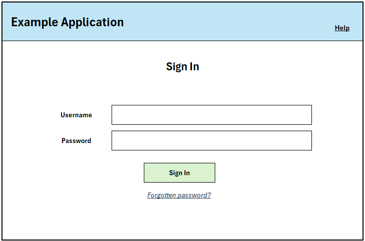
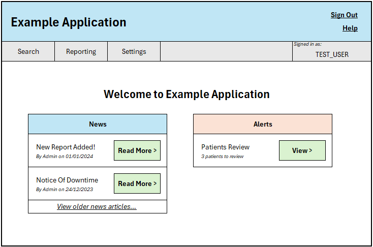

# Getting Started #3: From Codegen To Maintainable Tests

This guide outlines the process of taking a test generated using the `playwright codegen` tool to a state where it
will be easy to maintain going forward.

## Contents

- [Getting Started #3: From Codegen To Maintainable Tests](#getting-started-3-from-codegen-to-maintainable-tests)
  - [Contents](#contents)
  - [Setting The Scene](#setting-the-scene)
  - [Using `codegen` For A Test](#using-codegen-for-a-test)

## Setting The Scene

For this guide, we will look at refactoring a test that we've initially generated using the `codegen` utility provided
by Playwright into a format that will make it easy to maintain going forward.

To start, here is our application under test for the purposes of this guide:

- Login Screen: A simple username / password login screen.

<!-- vale off -->

<!-- vale on -->

- Main Menu: The landing page once logged in.

<!-- vale off -->

<!-- vale on -->

- Search Patient: Some functionality to search for patients in our application.

- View Patient: A page for viewing the patient we have selected from the search menu.

## Using `codegen` For A Test

